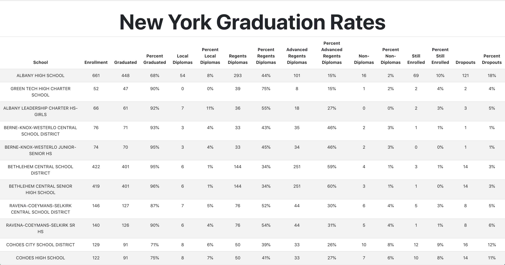

# New York Education Data Transparency - React

## The Goal
“Our state government possesses vast treasure troves of valuable information and reports: from health, business and public safety data to information on parks, recreation, labor, and transportation … The Open New York web portal will allow researchers, citizens, business and the media direct access to high-value data, which will be continually added to and expanded, so these groups can use the data to innovate for the benefit of all New Yorkers.” – Governor Cuomo, State of the State Address, January 9, 2013

In an effort to increase government transparency, New York is committed to providing its state data to its citizens. Yet, it is up to the citizens of New York to USE this data and do something with it.

In this lab you are going to take New York State education data downloaded from The Open New York web portal and build an easy to read website with it.

## The Lab
1. Add a table header row to your App.js file
To learn more about tables, head over to the W3schools documentation on HTML tables: https://www.w3schools.com/html/html_tables.asp

2. Create a component that displays a table row and can accept props.

3. Pass the first school's data into your component as props. This should result in having the data displayed on the table.

4. Using your table row component, display the first five schools data on your table.

## Stretch

5. Display ALL the school data on your table.

6. Rewrite this using CSS grid or CSS flexbox. Or, come up with any other fun or interesting way you can come up with to display this data!
